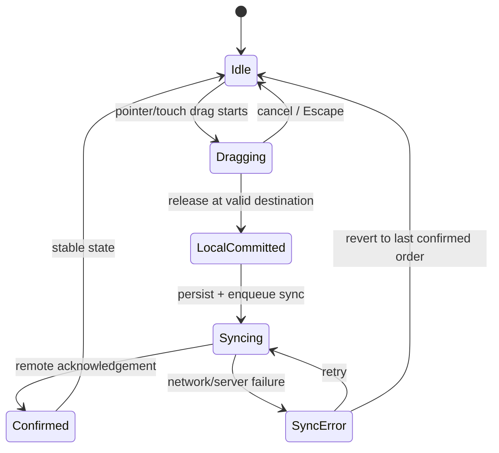
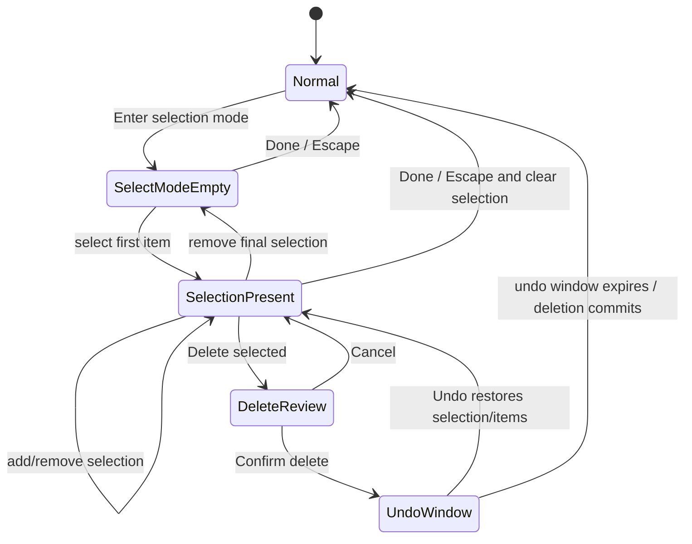
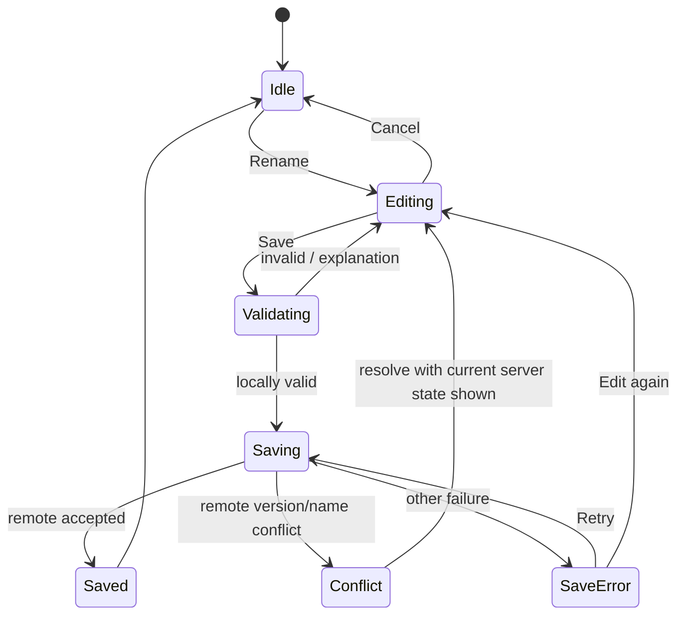

# Exercise 015 — Directness and Action-State Coupling Practice

Status: PRACTICE

Research basis: `research/015-directness-state-modes-reversibility.md`

## Exercise goal

Model interaction as an explicit relationship among user intention, articulation, user-facing state, persistence/commitment, feedback, and recovery.

The three flows intentionally use different interaction styles so that “directness” is not confused with “dragging.”

---

# Flow A — Reorder a prioritized list

## User goal

Move one item from position 5 to position 2 and keep the new order synchronized.

## Interaction hypothesis

Use direct drag/reorder with continuous local preview. The list should track the pointer/finger so the destination is inspectable before release. Releasing commits the new order locally; remote synchronization is a separate state.

## State model

## State/commitment table

| State | Visible list order | Persistence | Feedback | Recovery |
| --- | --- | --- | --- | --- |
| Idle | last current order | confirmed/local stable | no transient status | start reorder |
| Dragging | live preview order | not committed | dragged item + insertion position | Escape/cancel returns to starting order |
| LocalCommitted | new order | local commit | new order remains in place | undo available |
| Syncing | new order | local, remote pending | non-blocking sync status | continue work; undo policy defined |
| Confirmed | new order | remote confirmed | passive confirmation if needed | normal undo/history policy |
| SyncError | new or restored order according to product policy | remote failed | explicit failure + retry/revert | retry or revert |

## Input equivalence

Pointer/touch is not the only route.

Keyboard alternative:

1. focus the item;
2. invoke “Move” or a documented reorder shortcut;
3. move one position at a time with arrow keys;
4. confirm/drop;
5. Escape cancels before commit.

Assistive technology needs the item position, movement result, and final state exposed programmatically.

## Directness audit

- **Intent:** change list position.
- **Object:** visible list item.
- **Articulation:** spatial move maps to spatial result.
- **Transition:** drag preview → local commit → remote sync.
- **Feedback:** position changes continuously; sync state is separate.
- **Commitment:** preview, local, and remote-confirmed are not conflated.
- **Recovery:** cancel during preview; undo/revert after commit.
- **Mode:** dragging is temporary and user-maintained; it ends on drop/cancel.

## Deliberate failure variant

Rejected variant: animate the item into the new position on release, show a success check immediately, then silently restore the old order if synchronization fails.

Reason: the interface visually claims confirmation before the system has confirmed the remote state.

---

# Flow B — Multi-select mode with bulk deletion

## User goal

Select several records, perform a bulk action, and leave selection mode predictably.

## Interaction hypothesis

Selection mode is a persistent mode because ordinary taps/clicks change meaning while it is active. Mode state therefore needs persistent, redundant indication and explicit termination.

## State model

## Mode contract

While selection mode is active:

- a normal item activation no longer navigates to detail; it toggles selection;
- the top-level action area changes to show selection count and mode-specific actions;
- the current mode is communicated by text/structure, not color alone;
- `Escape`/Back/Done has defined behavior;
- navigation away clears or preserves selection only according to an explicit product rule;
- focus order remains operable when the action bar changes.

## Destructive-action strategy

Bulk deletion has higher consequence than single-item temporary manipulation. This exercise uses review + undo:

1. show the exact selection scope before deletion;
2. execute deletion after confirmation;
3. preserve a bounded undo path where product/data constraints allow it;
4. expose final commit when the undo window ends.

This is not a universal prescription. Products with reliably reversible deletion may choose perform + undo without a separate confirmation; externally irreversible actions may require stronger review.

## Input equivalence

Keyboard:

- enter selection mode through a focusable action or documented shortcut;
- Space toggles selection on focused items where platform semantics permit;
- mode-specific commands are reachable without pointer movement;
- Escape exits or cancels according to the documented state.

Screen-reader path:

- item selected/unselected state is programmatically available;
- selection count changes are announced appropriately without unnecessarily moving focus;
- destructive scope is available in text before confirmation.

## Mode-error probe

Failure variant: entering selection mode changes only the tint of the toolbar and item backgrounds; item activation silently changes from “open detail” to “toggle selection.”

Expected problem: a user who misses the subtle mode indicator may perform the correct physical action with the wrong mode interpretation.

---

# Flow C — Rename a cloud document

## User goal

Change a document name precisely while handling validation and remote conflicts.

## Why this flow is included

This is intentionally **not** a graphical drag interaction. Text entry has greater physical/articulatory effort than direct spatial manipulation, but the domain concept itself is textual. Typing the desired name can therefore have low semantic distance.

## State model

## State contract

### Editing

- draft differs from committed name;
- Cancel restores the prior committed value;
- closing the surface has an explicit draft policy.

### Validating

- deterministic local rules are checked before network request;
- errors identify the actual problem and preserve the entered draft.

### Saving

- the new name may be shown in context, but pending state is distinguishable from remote confirmation when that distinction matters;
- repeated Save activation is prevented or made idempotent.

### Conflict

- the interface does not reduce a real version/name conflict to “Something went wrong”;
- the current remote state and the user’s draft are both preserved when practical;
- recovery requires a meaningful choice rather than blind retry.

## Directness audit

This flow demonstrates that directness can come from semantic mapping rather than physical mimicry:

- user goal = specify a textual name;
- text input directly represents the domain value;
- validation feedback refers to the same visible draft;
- cancel and error states preserve user control.

---

# Cross-flow comparison

| Dimension | Flow A — Reorder | Flow B — Multi-select | Flow C — Rename |
| --- | --- | --- | --- |
| Primary intent | spatial repositioning | act on a set | set a textual value |
| Main articulation | drag / keyboard move | mode + selection | text input |
| Temporary state | dragging preview | selection mode | draft editing |
| Async state | remote order sync | deletion/commit may be async | remote save |
| Mode risk | low; held/temporary | high; persistent meaning change | moderate; editing context |
| Reversal | cancel/undo/revert | cancel/undo | cancel/edit/retry |
| Main failure risk | false remote confirmation | hidden mode | draft loss / vague conflict |

---

# Exercise evidence

The practice demonstrates:

1. direct manipulation with incremental preview;
2. explicit local-versus-remote commitment;
3. a persistent mode with changed action semantics;
4. destructive action and recovery;
5. keyboard/non-pointer alternatives;
6. status/error paths;
7. a semantically direct interaction that is not spatial manipulation;
8. state diagrams that define behavior before motion styling.

The separate critique determines what survives and what requires interactive validation.
